  

> **Building Practical Software through Code, Data, and Engineering.**

## About Me

I am a Physics student with an interest in **Software Development** and **Data Analytics**. I enjoy building practical projects, exploring how software works, and continuously improving my programming and problem-solving skills through hands-on learning.

---

## Current Focus

- Software Development
- Data Analytics
- Learning by Building

---

## Tech Stack

### Languages

  

### Development

  

### Data

  
  
  

### Tools

  

---

## Philosophy

> **Learning by building.**

I believe that building projects is one of the best ways to improve technical skills, understand new technologies, and solve practical problems.

---

## Featured Project

  

A hand-animated pixel-art SVG scene built using pure SVG and native web animation, without images, JavaScript, or frameworks.

  
  
  
  

---

## Connect With Me

- **LinkedIn:** [Galuh Kurnia Pratama](http://www.linkedin.com/in/galuh-kurnia-pratama-a25b9b325)
- **Instagram:** [@galhkoernia_](https://www.instagram.com/galhkoernia_/)
- **Email:** galuhkoernia@gmail.com

---

Thank you for visiting my GitHub profile.

I am always learning, building, and exploring new ways to create useful technology.
